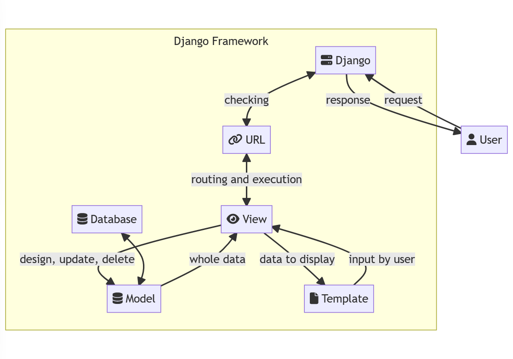

# Tugas 2: Pengenalan Aplikasi Django dan Models View Template (MVT) pada Django

Instansi Heroku: https://hanstm-pbp-tugas2.herokuapp.com/

1. Buatlah bagan yang berisi request client ke web aplikasi berbasis Django beserta responnya dan jelaskan pada bagan tersebut kaitan antara `urls.py`, `views.py`, `models.py`, dan berkas html.

[](https://mermaid.live/edit#pako:eNptUsGSmzAM_RWPzyTDQgIbptNTtqfupd320JKDg0XwBmxq7GZpyL9X2GbS2SknPUnvPVnoSivFgRa0btWlapg25GVfSoLftwH0z5oVNVtZDB0-kNXq46Thl4XBTGT_yuRJ-XYfh_rQKznA5Di-PNjjSbO-Wfo-adbBRemzL98VgiUSf6Opzx3Ih1m3aqA6C3lC3S-f7zwEgdQKeZ5h6NfKGmwnTHICb1AhUnIi3wVc7uwZBTqM4KB_JYdBnGREbM-ZgYhwaMHgm55xYW1gYIUd2QA-ebirOuxkLo1qgcyN_3P2TlgkRhEuhr5l40ReoMPAQHCpBSosuX9MlpQTEbK3hhxHMv-s91b7MOf7sZe8X5if2rNAchrRDnTHBMf7uM7pkpoGOihpgSGHmtnWlLSUN2z1a3riwihNC6MtRJRZo76Oslqw79kLhqfQUZykHTDbM0mLK32jRb5ZZ2kWZ0mWJHEepw8RHWmRZA_rTRpncRonebpJ8-0ton-UQoV4_Zg_ZrtdvtlmW6TmOyf3wxWDPLiRnv2Zu2u__QWLgPN2)

2. Jelaskan kenapa menggunakan *virtual environment*? Apakah kita tetap dapat membuat aplikasi web berbasis Django tanpa menggunakan *virtual environment*?

*Virtual enviroment* (lingkungan virtual) digunakan untuk mengisolasi lingkungan Python yang digunakan pada suatu tempat/proyek dengan lingkungan Python lainnya, termasuk lingkungan Python global.

Kita tetap dapat membuat aplikasi Django tanpa menggunakan *virtual enviroment*, namun versi Python dan versi-versi *libraries* yang digunakan perlu diperhatikan agar tidak bermasalah. 

3. Jelaskan bagaimana cara kamu mengimplementasikan poin-poin tersebut.

- Tambah aplikasi `katalog` pada `INSTALLED_APPS`.
- Buat file `models.py` dan tambah model yang digunakan sesuai dengan data yang ada.
- Jalankan `python manage.py makemigrations` sebagai persiapan migrasi DB dan `python manage.py migrasi` untuk migrasi DB.
- Buat file `views.py` dan tambah fungsi untuk menjawab (*response*) sebuah permintaan (*request*). Lengkapi juga sehingga dapat memberikan data/`context` sesuai dengan data yang dimiliki.
- Ubah templat di `wishlist.html` agar dapat menunjukkan data yang telah diberikan dari `context`.
- Buat file `urls.py` di dalam folder aplikasi dan tambah fungsi dari `views.py` sebagai jawaban pada halaman indeks (`/`).
- Tambah `urls.py` sebelumnya ke dalam file `urls.py` di dalam folder proyek (`project_django`)
- Buat aplikasi baru di Heroku, dan dapatkan API key dan nama aplikasinya di sana
- Tambah variabel-variabel tersebut (`HEROKU_API_KEY` dan `HEROKU_APP_NAME`) di `Repository secrets` pada repository GitHub yang dimiliki.
- *Add*, *commit*, dan *push* perubahan yang ada. GitHub Actions akan men-*deploy* aplikasi ke Heroku. 