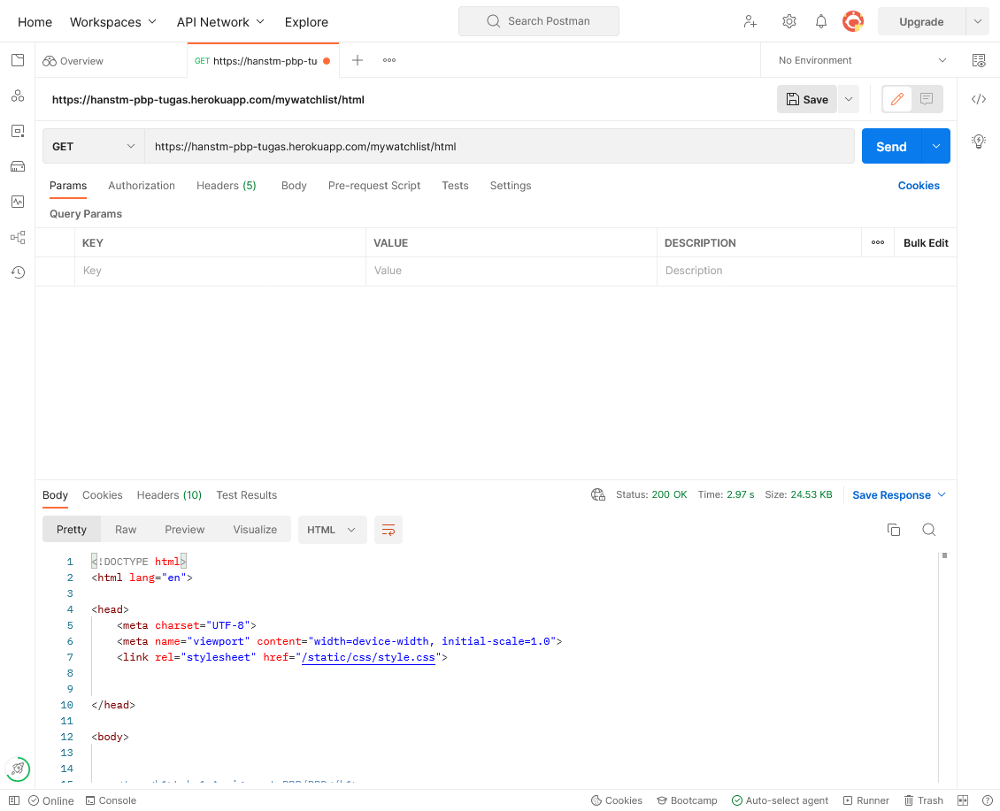
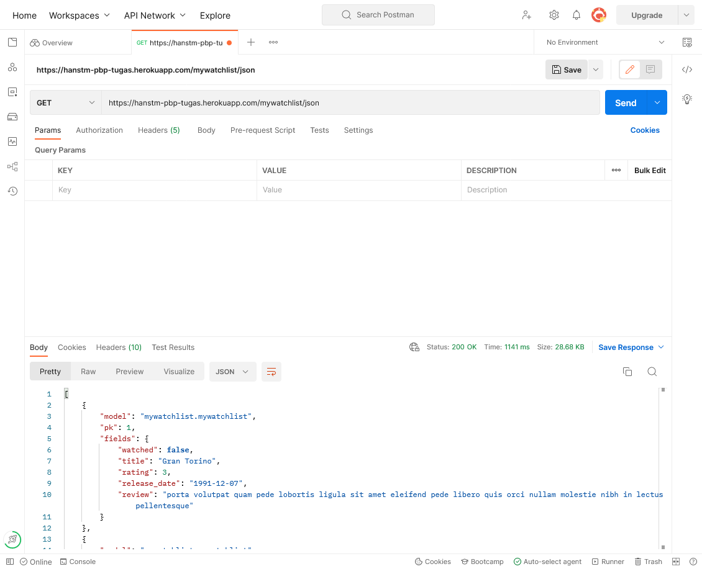
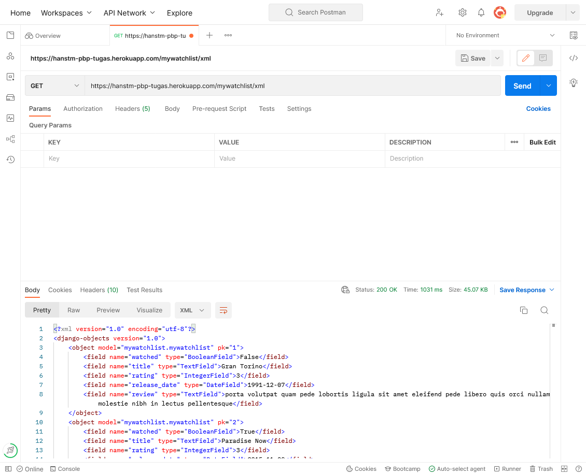

# Tugas 3: Pengimplementasian Data Delivery Menggunakan Django

Selamat datang! Repositori ini digunakan untuk [Tugas 3](https://pbp-fasilkom-ui.github.io/ganjil-2023/assignments/tugas/tugas-3) dalam mata kuliah Pemrograman Berbasis Platform. 

Aplikasi Heroku: https://hanstm-pbp-tugas.herokuapp.com/mywatchlist

## Routing

Daftar tingkat pertama adalah URL yang ditugaskan wajib. Yang lain dibuat sebagai pelengkap.

- [/html](https://hanstm-pbp-tugas.herokuapp.com/mywatchlist/html)
  - Per ID: [/html/:id](https://hanstm-pbp-tugas.herokuapp.com/mywatchlist/html/1)
  - Alias: [/](https://hanstm-pbp-tugas.herokuapp.com/mywatchlist/)
- [/xml](https://hanstm-pbp-tugas.herokuapp.com/mywatchlist/xml)
  - Per ID: [/xml/:id](https://hanstm-pbp-tugas.herokuapp.com/mywatchlist/xml/1) 
- [/json](https://hanstm-pbp-tugas.herokuapp.com/mywatchlist/json)
  - Per ID: [/json/:id](https://hanstm-pbp-tugas.herokuapp.com/mywatchlist/json/1)

## Checklist

- [x] Membuat suatu aplikasi baru bernama `mywatchlist` di proyek Django Tugas 2 pekan lalu
- [x] Menambahkan _path_ `mywatchlist` sehingga pengguna dapat mengakses http://localhost:8000/mywatchlist
- [x] Membuat sebuah model `MyWatchList` yang memiliki atribut sebagai berikut:
    - [x] `watched` untuk mendeskripsikan film tersebut sudah ditonton atau belum
    - [x] `title` untuk mendeskripsikan judul film
    - [x] `rating` untuk mendeskripsikan rating film dalam rentang 1 sampai dengan 5
    - [x] `release_date` untuk mendeskripsikan kapan film dirilis
    - [x] `review` untuk mendeskripsikan _review_ untuk film tersebut
- [x] Menambahkan minimal 10 data untuk objek `MyWatchList` yang sudah dibuat di atas
- [x] Mengimplementasikan sebuah fitur untuk menyajikan data di poin 4 dalam tiga format:
    - [x] HTML
    - [x] XML
    - [x] JSON 
- [x] Membuat _routing_ sehingga data di atas dapat diakses melalui URL:
    - [x] http://localhost:8000/mywatchlist/html untuk mengakses `mywatchlist` dalam format HTML
    - [x] http://localhost:8000/mywatchlist/xml untuk mengakses `mywatchlist` dalam format XML
    - [x] http://localhost:8000/mywatchlist/json untuk mengakses `mywatchlist` dalam format JSON
- [x] Melakukan _deployment_ ke Heroku terhadap aplikasi yang sudah kamu buat sehingga nantinya dapat diakses oleh teman-temanmu melalui Internet.
- [x] Membuat sebuah `README.md` yang berisi tautan menuju aplikasi Heroku yang sudah kamu _deploy_ serta jawaban dari beberapa pertanyaan berikut:
- [x] Mengakses tiga URL di poin 6 menggunakan Postman, menangkap _screenshot_, dan menambahkannya ke dalam `README.md`
- [x] Menambahkan _unit test_ pada `tests.py` untuk menguji bahwa tiga URL di poin 6 dapat mengembalikan respon `HTTP 200 OK`

### Bonus

- [x] Jika jumlah film yang sudah ditonton lebih banyak atau sama dengan jumlah film yang belum ditonton, tampilkan pesan "Selamat, kamu sudah banyak menonton!" dalam bentuk HTML
- [x] Jika jumlah film yang belum ditonton lebih banyak dari jumlah film yang sudah ditonton, tampilkan pesan "Wah, kamu masih sedikit menonton!" dalam bentuk HTML

## Jawaban

### Postman

HTML

JSON

XML

### Pertanyaan

1. Jelaskan perbedaan antara JSON, XML, dan HTML!

HTML adalah sebuah bahasa *markup* (*markup language*) untuk halaman-halaman yang biasa ditunjukkan dalam sebuah peramban web (*web browser*). HTML dapat didukung dengan JS dan CSS untuk menambah fungsi dan mengubah gaya halaman HTML yang ada.

JSON adalah sebuah format data yang umum digunakan. JSON diturunkan dari JavaScript, namun sering digunakan dalam bahasa pemogramman yang lain.

XML adalah sebuah bahasa *markup* sekaligus sebagai sebuah format data. Bentuknya serupa seperti HTML, namun difokuskan dalam penyimpanan data.

2. Jelaskan mengapa kita memerlukan _data delivery_ dalam pengimplementasian sebuah platform?

Data yang ingin digunakan oleh pengguna harusnya dapat disajikan dengan metode yang tepat.

3. Jelaskan bagaimana cara kamu mengimplementasikan poin 1 sampai dengan 3 di atas.

- Buat aplikasi baru dan tambahkan di `settings.py` (`INSTALLED_APPS`) dalam proyek.
- Buat template HTML untuk *data delivery* dengan HTML, lalu tambahkan itu ke dalam `views.py`
- Side: Implementasi bonus. Tambah pesan sesuai jumlah yang telah ditonton.
- Bersamaan dengan sebelumnya, tambahkan view yang sesuai untuk JSON dan XML ke dalam `views.py`
- Side: Tambah view untuk ID spesifik di `views.py`.
- Tambah `urlpatterns` yang sesuai di dalam `urls.py`.
- Tambah `urls.py` aplikasi ke dalam `urls.py` proyek.
- Buat data, [Mockaroo](https://www.mockaroo.com/) digunakan untuk mempermudah pembuatan, dengan penyesuaian.
- Buat model yang digunakan sesuai dengan data yang ada pada `models.py`.
- Buat unit test untuk memeriksa respons aplikasi.
- *Add*, *commit*, dan *push* perubahan yang ada. GitHub Actions akan men-*deploy* aplikasi ke Heroku
- Gunakan Postman untuk memeriksa respons aplikasi dari luar.